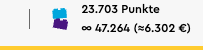

# LEGO® Total Insider Points Display browser extension

> An unofficial browser extension that displays the total number of accumulated Insider points for the currently logged in account alongside the current available points.

## About

This extension helps LEGO Insider members track their total accumulated points by displaying them alongside redeemable points on lego.com.

**Note:** Insider points where formerly known as VIP points and have been re-branded by LEGO. The accumulated points include points from the era your account belonged to the VIP program.

## Usage

### 1. Install the extension for your browser

[Brave](https://chromewebstore.google.com/detail/nejpchjnedkicmoccaccjnljdmdgelmb)  
[Chrome](https://chromewebstore.google.com/detail/nejpchjnedkicmoccaccjnljdmdgelmb)  
[Edge](https://microsoftedge.microsoft.com/addons/detail/geeffodmpkcpeikbchllbnhibhgddemi)  
[Firefox](https://addons.mozilla.org/en-GB/firefox/addon/lego-total-insider-points/)  

### 2. Sign in to your LEGO® account on lego.com

Navigate to any page showing your Insider points (on the top right).

See your total points displayed below your redeemable points:  
23,703 Points ← Redeemable (shown by LEGO®)  
∑ 47,264 ← Total (added by extension)  

## Features

✨ **Total Points Display** - See your lifetime Insider points at a glance  
💰 **Money Spent Calculator** - Optional display of estimated spending  
🎨 **11 Custom Symbols** - Personalize your display  
🌍 **Multi-language** - Support for EN, DE  
🔒 **Privacy First** - No data collection, everything stays local  

## How it works

Following an [investigation](https://t.me/stonewarschat/617676) by Telegram group ["StoneWars Chat"](https://t.me/stonewarschat) user [Mariane](https://t.me/Brick_Jongleur) it seems the total number of points is still exposed just not shown to the user anymore (in the member section as before).

This extension intercepts the network request the LEGO® website performs to fetch the current users infos (name, number of points, locale among others) and extracts the total points from the responses JSON object `data.me.vip.totalPoints`.

All calculations happen locally in your browser.

### Bonus feature

The extension also shows you the amount of money you must have spent to gain this amount of points. To not emberass yourself or let your wife see how much you enjoy LEGO®, this feature is off by default. You can enable it on the extensions option page.

## Customize

- Choose your preferred symbol (∑, 🏆, ⭐, etc.)
- Toggle money spent calculation
- See real-time preview

## Privacy

✅ Only reads data from lego.com  
✅ Settings stored locally on your device  
✅ No analytics or tracking  
✅ No data sent to external servers  
✅ Open source - verify [the code](https://github.com/pke/lego-total-points-extension) yourself  

## Support

Having issues?

✅ Check you're signed in to lego.com  
♻️ Refresh the page  
⚠️ Report an issue on [GitHub Issues](https://github.com/pke/lego-total-points-extension/issues)  

## Acknowledgements

Many thanks to [Mariane](https://t.me/Brick_Jongleur) for the initial idea!

## License

MIT License - See [LICENSE](./LICENSE) file

## Disclaimer

This extension is an independent fan project and is not affiliated with, endorsed by, or sponsored by the LEGO Group. LEGO® is a trademark of the LEGO Group of companies which does not sponsor, authorize or endorse this extension.
